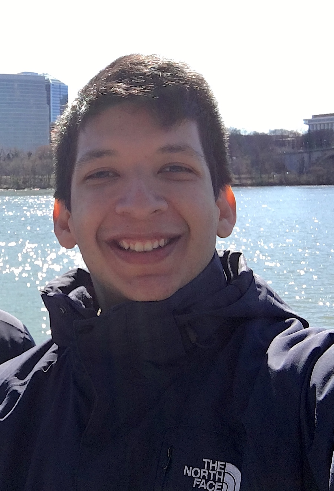

# About Me

I am a final year Ph.D. student in [Computer Science at Brown University](https://cs.brown.edu) in the [Intelligent Robot Lab](http://irl.cs.brown.edu) advised by [George Konidaris](http://cs.brown.edu/people/gdk/). Previously, I got a Bachelor's degree in Electronic Engineering from [Universidad Simon Bolivar](http://www.usb.ve), Caracas, Venezuela and a Master's degree in Computer Science from [Politecnico di Milano](https://polimi.it) where I was fortunate to work with [Marcello Restelli](https://restelli.faculty.polimi.it/MyWebSite/index.shtml) and [Nicola Gatti](https://gatti.faculty.polimi.it) at the [AIRLAB](http://airlab.deib.polimi.it). 

Moreover, in Summer 2021, I interned at Amazon Alexa and worked in the Dialogue Research group with Maryam Fazel-Zarandi on applications of LLMs (Large Language Models) and RL in Task-oriented Dialog Systems.

**Contact** rrs *at* brown *dot* edu --- **[Google Scholar](https://scholar.google.com/citations?user=ONxoqRUAAAAJ&hl=es)** --- **[LinkedIn](https://linkedin.com/in/rafarodsa)**
--- **[Github](https://github.com/rafarodsa)**

# Research Interests

I am deeply interested in enabling decision-making agents to learn reusable knowledge. To that end, currently, I'm working on learning state abstractions for Reinforcement Learning and, more generally, MDPs, that allow agents to learn provably sound, abstract and simpler world models that the agent can use to generate plans for different tasks.

Furthermore, I've also worked at the intersection of Natural Language and RL, investigating how to communicate prior knowledge to RL agents through languages. From this endeavor, RLang, a formal language for RL, was born. This language is unambiguous and designed precisely for RL. RLang allows to communicate partial task-specific knowledge to RL agents in order to avoid tabula rasa learning. The RLang framework, also, opens up many exciting research questions in RL algorithm design, natural language understanding and symbol grounding. 

# Publications

## **Conferences**

- A. Bagaria, A. De Mello Koch, **R. Rodriguez-Sanchez**, S. Lobel, G. Konidaris. *Intrinsically Motivated Discovery of Temporally
Abstract Graph-based Models of the World*. 2nd Reinforcement Learning Conference (RLC), Edmonton, Alberta, 2025.
[<a href="#" onclick="toggleExpand('abstract1')">abstract</a>] [[paper](https://openreview.net/pdf?id=vjT2aL6Wlg)]

    We seek to design reinforcement learning agents that build plannable models of the world
    that are abstract in both state and time. We propose a new algorithm to construct a skill graph;
    nodes in the skill graph represent abstract states and edges represent skill policies. Previous
    works that learn a skill graph use random sampling from the state-space and nearest-neighbor
    search—operations that are infeasible in environments with high-dimensional observations (for
    example, images). Furthermore, previous algorithms attempt to increase the probability of all
    edges (by repeatedly executing the corresponding skills) so that the resulting graph is robust
    and reliable everywhere. However, exhaustive coverage is infeasible in large environments,
    and agents should prioritize practicing skills that are more likely to result in higher reward. We
    propose a method to build skill graphs that aids exploration, without assuming state-sampling,
    distance metrics, or demanding exhaustive coverage.

 

- **R. Rodriguez-Sanchez**, G. Konidaris. *Learning Abstract World Models for Value-preserving Planning with Options*. 1st Reinforcement Learning Conference (RLC), Amherst, MA, 2024.  
[<a href="#" onclick="toggleExpand('abstract2')">abstract</a>] [[paper](https://openreview.net/pdf?id=h9IvopsMFS)] [[code](https://github.com/rafarodsa/abs-mdp)]

    General-purpose agents require fine-grained controls and rich sensory inputs to perform a wide range of tasks. However, this complexity often leads to intractable decision-making. Traditionally, agents are provided with task-specific action  and observation spaces to mitigate this challenge, but this reduces autonomy. 
    Instead, agents must be capable of building state-action spaces at the correct abstraction level from their sensorimotor experiences. We leverage the structure of a given set of temporally-extended actions to learn abstract Markov decision processes (MDPs) that operate at a higher level of temporal and state granularity. We characterize state abstractions necessary to ensure that planning with these skills, by simulating trajectories in the abstract MDP, results in policies with bounded value loss in the original MDP.
    We evaluate our approach in goal-based navigation environments that require continuous abstract states to plan successfully and show that abstract model learning improves the sample efficiency of planning and learning.

 

- **R. Rodriguez-Sanchez**\*, B. Spiegel\*, J. Wang, R. Patel, S. Tellex, G. Konidaris. *RLang: A Declarative Language for Describing Partial World Knowledge to Reinforcement Learning Agents*. International Conference on Machine Learning (ICML). Honolulu, Hawaii, 2023. 
[<a href="#" onclick="toggleExpand('abstract3')">abstract</a>] [[paper](https://proceedings.mlr.press/v202/rodriguez-sanchez23a/rodriguez-sanchez23a.pdf)] [[RLang.ai](http://rlang.ai)] [[RLang package](https://github.com/brownirl/rlang)] 

    We introduce RLang, a domain-specific language (DSL) for communicating domain knowledge to an RL agent. Unlike existing RL DSLs that ground to single elements of a decision-making formalism (e.g., the reward function or policy), RLang can specify information about every element of a Markov decision process. We define precise syntax and grounding semantics for RLang, and provide a parser that grounds RLang programs to an algorithm-agnostic partial world model and policy that can be exploited by an RL agent. We provide a series of example RLang programs demonstrating how different RL methods can exploit the resulting knowledge, encompassing model-free and model-based tabular algorithms, policy gradient and value-based methods, hierarchical approaches, and deep methods.

 

- [A. Tirinzoni](https://andreatirinzoni.github.io)\*, **R. Rodriguez-Sanchez**\*, [M. Restelli](https://restelli.faculty.polimi.it/MyWebSite/index.shtml). *Transfer of Value Functions via Variational Methods*. Advances in Neural Information Processing Systems (NeurIPS), Montreal, Canada, 2018. 
[<a href="#" onclick="toggleExpand('abstract4')">Abstract</a>] [[paper](https://proceedings.neurips.cc/paper_files/paper/2018/file/9023effe3c16b0477df9b93e26d57e2c-Paper.pdf)][[poster](/nips2018_poster_transfer.pdf)][[code](https://github.com/AndreaTirinzoni/variational-transfer-rl)]

    We consider the problem of transferring value functions in reinforcement learning. We propose an approach that uses the given source tasks to learn a prior distribution over optimal value functions and provide an efficient variational approximation of the corresponding posterior in a new target task. We show our approach to be general, in the sense that it can be combined with complex parametric function approximators and distribution models, while providing two practical algorithms based on Gaussians and Gaussian mixtures. We theoretically analyze them by deriving a finite-sample analysis and provide a comprehensive empirical evaluation in four different domains.

## **Workshops**

- **R. Rodriguez-Sanchez**, G. Konidaris. *Learning Abstract World Models for Value-preserving Planning with Options*. Generalization in Planning at NeurIPS 2023 **(Contributed Talk)** and LatinX in AI Workshop. New Orleans, LA.  
[<a href="#" onclick="toggleExpand('abstract5')">Abstract</a>][[Paper](/genplan2023.pdf)]

    General-purpose agents require fine-grained controls and rich sensory inputs to perform a wide range of tasks. However, this complexity often leads to intractable decision-making. Traditionally, agents are provided with task-specific action  and observation spaces to mitigate this challenge, but this reduces autonomy. 
    Instead, agents must be capable of building state-action spaces at the correct abstraction level from their sensorimotor experiences. We leverage the structure of a given set of temporally-extended actions to learn abstract Markov decision processes (MDPs) that operate at a higher level of temporal and state granularity. We characterize state abstractions necessary to ensure that planning with these skills, by simulating trajectories in the abstract MDP, results in policies with bounded value loss in the original MDP.
    We evaluate our approach in goal-based navigation environments that require continuous abstract states to plan successfully and show that abstract model learning improves the sample efficiency of planning and learning.

- **R. Rodriguez-Sanchez**, B. Spiegel, J. Wang, R. Patel, S. Tellex, G. Konidaris. *RLang: A Declarative Language for Expressing Prior Knowledge for Reinforcement Learning*. Multidisciplinary Conference on Reinforcement Learning and Decision Making (RLDM) 2022. Providence, RI.
[[paper](/rlang_rldm2022.pdf)] [[poster](/rlang_rldm_poster.pdf)]

- **R. Rodriguez-Sanchez**\*, [R. Patel](http://cs.brown.edu/people/rpatel59/)\*, [G. Konidaris](http://cs.brown.edu/people/gdk/). *On the Relationship Between Structure in Natural Language and Models of Sequential Decision Processes*. Language and Reinforcement Learning ([LaReL](https://larel-ws.github.io/accepted-papers/)) Workshop at the International Conference in Machine Learning (ICML) 2020. 
[[paper](/on_the_relationship_between_structure_in_natural_language_and_models_of_sequential_decision_processes.pdf)] [[video](https://www.youtube.com/watch?v=a3JJo_cvzpE&feature=emb_logo)]

- [A. Tirinzoni](https://andreatirinzoni.github.io), **R. Rodriguez-Sanchez**, [M. Restelli](https://restelli.faculty.polimi.it/MyWebSite/index.shtml). *Transferring Value Functions via Variational Methods*. European Workshop on Reinforcement Learning (EWRL) 2018. Lille, France. **Oral**. [[EWRL 2018](https://ewrl.wordpress.com/past-ewrl/ewrl14-2018/)].
